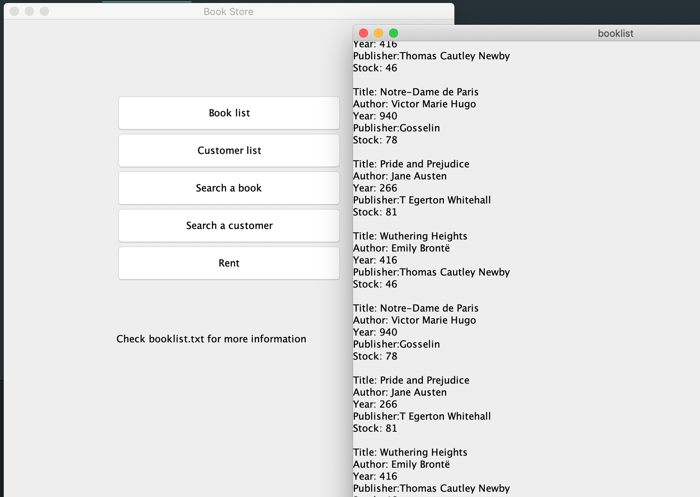

# Book Store Application

Simple Book Store Application to practice Java GUI (Graphic User Interface) using java Swing.

## Usage

To complie this project:

> $ `javac GUI.java`

To run this:

> $ `java GUI`

## Author

Name: Duo Li

Email: duo1998@uab.edu
